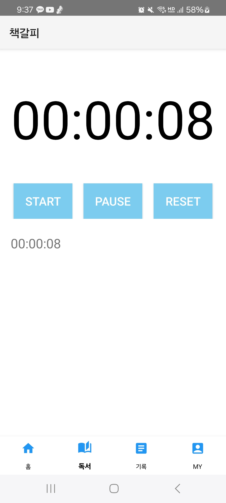
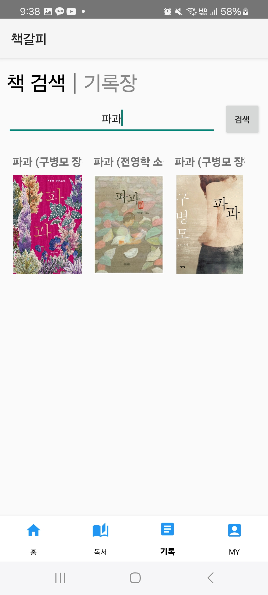
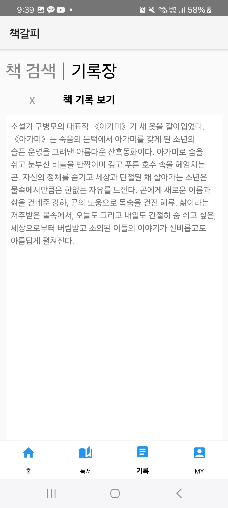
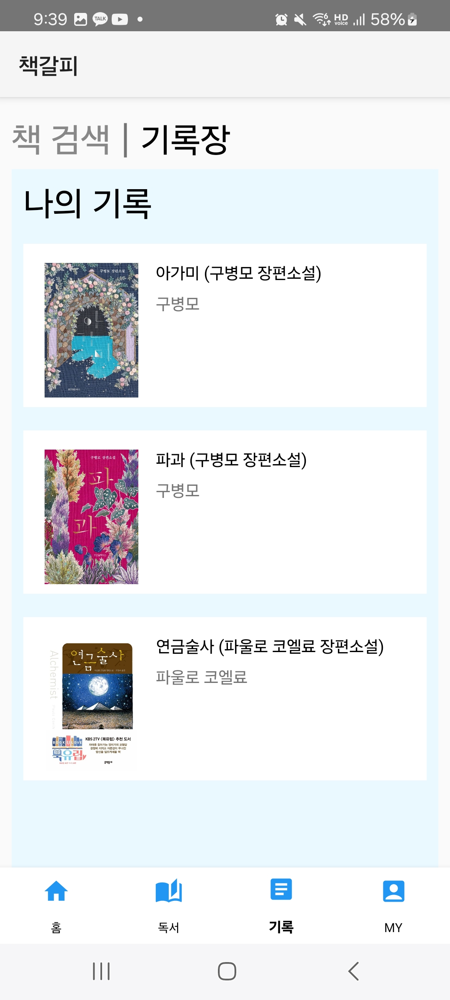
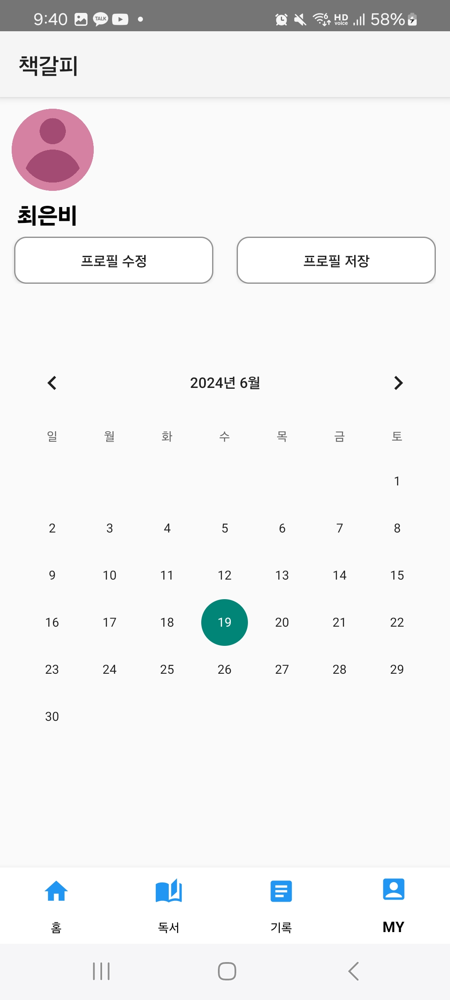

# 책갈피

### 읽고 싶은 책 목록과 책에 대한 기록을 관리하는 어플리케이션

2271161 최은비

### 1. 프로젝트 수행 목적
#### 1.1 프로젝트 정의
   * 읽고 싶은 책 목록과 책에 대한 기록을 관리하는 어플리케이션
   
#### 1.2 프로젝트 배경
   * 온전히 책에 대한 기록만을 할 수 있는 어플리케이션을 만들어 더 편리하게 관리할 수 있는 온라인 '책장'을 제공하려고 한다.

### 2. 프로젝트 개요
#### 2.1 프로젝트 설명

  * 홈 화면에서 베스트셀러 책들을 볼 수 있다.
  * 독서한 시간을 측정하고 기록할 수 있다.
  * 책 제목을 검색하여 책에 대한 자세한 정보를 확인해볼 수 있다.
  * 마음에 드는 책은 '찜'버튼을 클릭하여 홈 화면에 저장하고, 목록을 관리할 수 있다.
  * 책에 대한 글을 쓰고 관리할 수 있다.
  * 자신만의 프로필을 만들고 수정할 수 있다.

#### 2.2 프로젝트 구조

#### 2.3 결과물
  * 홈 화면
  

  * 독서 화면
  

  * 기록 화면
    - 책 검색
      
    
    - 책 기록
      

  * 마이페이지 화면
  

#### 2.4 발표 영상
https://youtu.be/H4vWrjrsPTE?si=XxuYuMPwKdVSQ9RV
    
